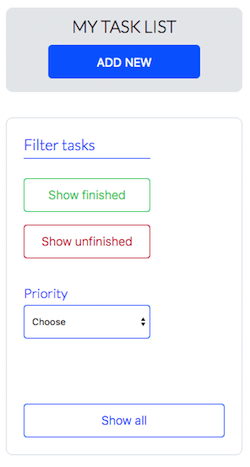
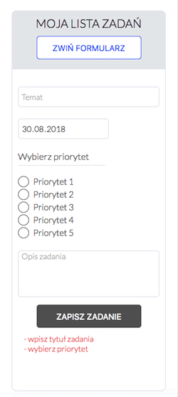
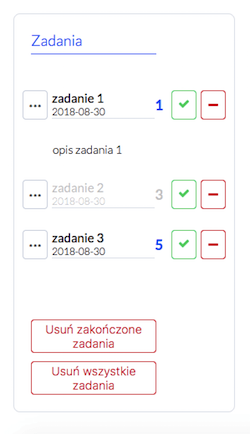
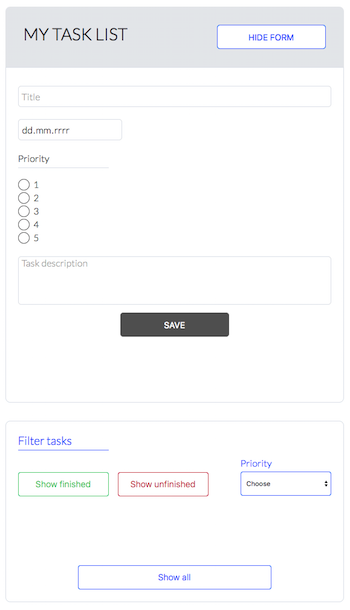
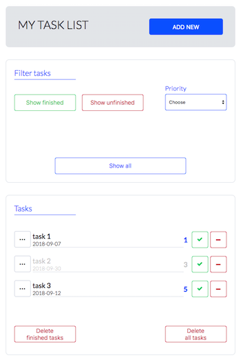

# ToDo List

Here is my ToDo List - a single page application developed with [Ewa Biedulska](https://github.com/ewabiedulska) in Vanilla JS.


## Getting Started

To run this project you will need to have **Node.js** and **Gulp** installed on your local machine. After forking and cloning the repo please run these commands in your command line:

```
npm install
```

and

```
gulp
```

The project should automatically open in your browser at http://localhost:3000. All the tasks will be stored in your browser's Local Storage.


## Tools

- Vanilla JS
- Sass
- Gulp
- Local Storage


## Design

The site is designed with RWD approach, mobile-first.


## Features

- adding new tasks (with a date, priority and description) by filling in a form sliding down after clicking "Add new"
- form validation - before a new task is added to the list the app checks if you have entered a title (not longer than 25 characters), a date and chosen a priority. It is possible to add a task without a descprition but if you do add it, it can't be longer than 100 characters. A date validation is pretty basic right now - you need to enter anything to go through.
- filters - you can select completed/uncompleted tasks, tasks with a given priority or just show all of them.
- showing a sliding down task's description by clicking a "More" button
- marking completed tasks with a tick (completed tasks go pale)
- deleting single tasks with a minus
- deleting all the completed tasks
- deleting all the tasks on the list

#### 

## Demo

### **[ToDo List](https://karin-on.github.io/to-do-list/)**


## Previews







